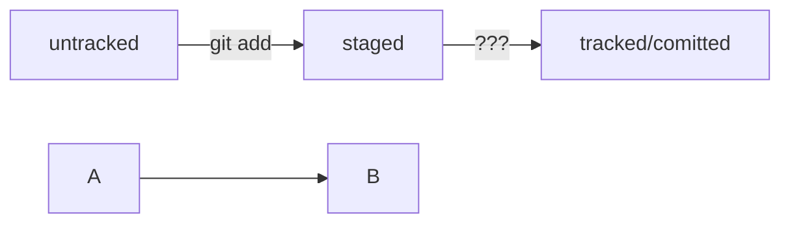

# Markdown шпарггалка
## Выделение текста 

Вы можете выделить текст в markdown с помощью символа `_` или `*`. Например:

Пример _курсив_ и **жирного** текста.

## Заголовки

Заголовки можно создавать с помощью символа `#`. Чем больше `#`, тем меньше заголовок. Например:

# Заголовок первого уровня 
## Заголовок второго уровня
### Заголовок третьего уровня

## Выделение кода

Чтобы выделить текст как код, поместите его в тройные кавычки ``````.

```
mkdir my_project
cd my_project
git init
```
Это лишь некоторые функции markdown.

HEAD -- это голова.
Коммит -- это всему голова.
Статусы файлов:
<тут пустая строка!>

```mermaid
%% описание схемы
```
<и тут пустая строка!> 




